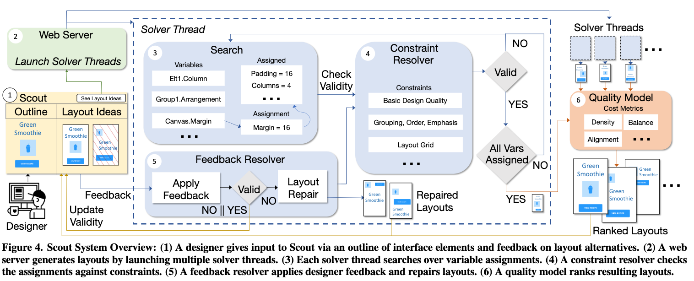

[(PDF) Scout: Rapid Exploration of Interface Layout Alternatives through High-Level Design Constraints](https://www.researchgate.net/publication/338620919_Scout_Rapid_Exploration_of_Interface_Layout_Alternatives_through_High-Level_Design_Constraints)

[20201112_scout.md](./20201112_scout.md) の 2020 版の論文。（Scout の概要は [20201112_scout.md](./20201112_scout.md) を参照）

## 概要

デザイナーが UI を設計する際には多様な案を作ることが大切であり、複数のデザインを作成することで、より高品質で多様なソリューションが得られることは研究で明らかになっている。これは、多様な案を比較することでより強力な批評と意思決定が可能になるためである。しかし、高品質で多様なデザイン案を複数作成するには多くの労力を必要とする。

他のデザイン例からインスピレーションを受けて作成する際にも、細かい（= 低レベル）のサイズやスタイルの調整、要素の再配置が必要になり、これらを品質を維持しながら行うのも難しい。

これを解消できるのが Scout であり、デザイナーは Scout を使用して UI 要素と高レベルの制約（意味的構造、順序、強調など）を表現できる。Scout はそれらの制約を満たす複数のレイアウト案を生成して、デザイナーのアイデア出しを補助する。

Scout の目標は、多くの多様なデザインを生成するために制約ソルバーを活用することであり、これまでの研究のように制約の曖昧さを減らして 1 つのデザインを生成することに焦点を当ててはいない。また、 Apple Auto Layout で数式で表現されるような低レベルの制約はデザイナーにとって非直感的であるというデメリットも有るため、高レベルの制約を指定できるのはメリットになる。（下図は論文より）

## レイアウトの探索

Scout は a modified branch and bound search というアルゴリズム（制約充足問題を解くアルゴリズム）によってレイアウトを生成する。レイアウトは例えば `alignment = one of [top, left, xcenter, ycenter, bottom, right]` のような変数の組み合わせによって表現される。

### レイアウトの評価

探索の計算量は膨大になってしまい、美しくないレイアウトも生成されるため、高品質なレイアウトを定量的に評価する必要があるが、それは size, balance, alignment から計算される quality によって評価される。size スコアは大きすぎたり小さすぎたりする要素を持つグループに罰則を与える。balance スコアは連続した要素のペアに等間隔のマージンが与えられているかどうかを評価する。alignment スコアはグループ内での整列の質を評価する。これを合計した quality をグループごとに評価して、最後に quality の加重平均を取って Layout Score とする。

その他の指標についても論文で紹介されている。

## Scout の効果

Scout の効果を測定するために 3 つの質問を被験者（UI デザイナー）にした。

- Scout は他のツール（Adobe XD）と比較してより多様な UI レイアウトが可能か
- Scout は他のツールと比較してより高品質な UI レイアウトが可能か
- Scout はデザイナーが UI レイアウトを探索するプロセスにどのように影響を与えるか

Scout はデザイナーが思いもよらないレイアウトのアイデアを生み出すのに役立ち、 1 つのデザインに固執しすぎるのも防ぎ、既存パターンと異なるレイアウトを検討するのに役立つことが判明した。Scout を使うと多様なデザイン案を生成できることも分かっている。

エキスパートデザイナーでは Scout よりも既存手法の方がやや高品質なデザインを生成していたことから、 Scout には改善の余地があることも示唆される。（この点については、 Scout を利用してから手で微調整できるため何とも言えないが）

## 今後の展望

- Scout で調整しているパラメータを直接デザイナーが触るようなインターフェースの設計もアリ
- Scout は現在、普通の mobile インターフェース程度の複雑さに対して適用できるが、今後の研究により Scout をより大きく複雑なインターフェースにスケールアップできるだろう。

## 感想

「ブレインストーミングが簡単になった」「インターネットで既存のデザインを探すのではなく、手元で簡単にできる」「自分のパーツでどんなレイアウトになるかをすぐに見ることができる」という感想が記述されていて興味深かった。

Scout は機械学習ではなく constraint solving を利用しているため、生成アルゴリズムが探索するレイアウトの属性を直接制御でき、デザインデータセット無しで合理的なデザイン案を生成できる。

### 補足

- 動画: [Amanda Swearngin | DUB Shorts | April 15, 2020 on Vimeo](https://vimeo.com/410762398)
- ACM: [Scout: Rapid Exploration of Interface Layout Alternatives through High-Level Design Constraints | Proceedings of the 2020 CHI Conference on Human Factors in Computing Systems](https://dl.acm.org/doi/10.1145/3313831.3376593)
