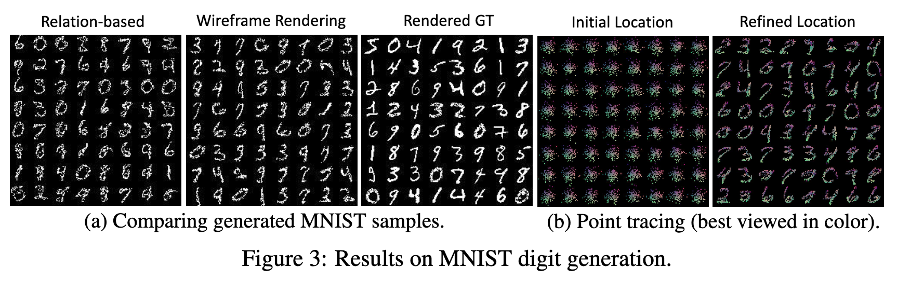
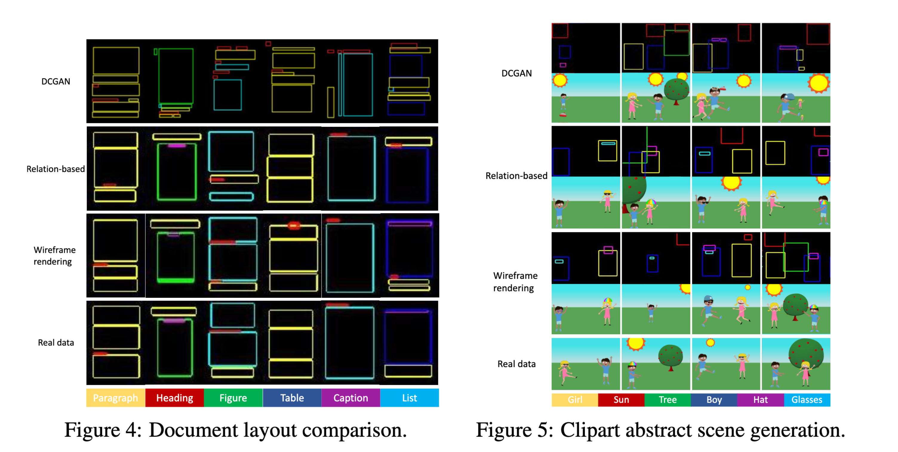

3 LayoutGAN の具体的な説明は流し読みしているため、このアーキテクチャに興味が湧いたときにまた読んでまとめる。

## 概要

### どんなものか

デザイン要素のレイアウトを生成するための新しい GAN である LayoutGAN を提案している。
これはピクセルレベルで画像を生成する（ため、レイアウトを正確に捉えられない）従来の GAN とは異なり、画像ではなくデザイン要素の集合 {(pi, θi)} を直接出力する。
生成されたグラフィック要素をワイヤーフレーム画像にラスタライズする Wireframe Rendering 層は、 CNN を識別器として活用して visual domain からのレイアウト最適化を可能にしている。

#### 解決している問題

高品質なデザインやレイアウトを人が作るのは大変。

#### 解決方法

レイアウトの生成に焦点を当てて、GAN = Generative Adversarial Network を用いて高品質なレイアウトを自動生成している。

Generator はランダムに配置された 2 次元グラフィック要素のセットを受け取り、Self-Attention モジュールを使用してラベルと幾何学的パラメータを調整し、リアルなレイアウトを生成する。
Discriminator としては 2 種類紹介されている。
Relation-based は基本的に Generator と同様の仕組みで、クラス確率と幾何学的パラメータに作用する。
これは要素間の位置ずれや occulusion に対して十分な感度を持たない。
Wireframe Rendering はこれに対し、visual domain で動作、つまり 2 次元にマッピングしてから評価するようになっている。
グラフィック要素の合成データと実構造化データの両方をラスタライズしてワイヤーフレーム画像に変換し、その上で標準的な CNN を利用してビジュアルとグラフィック領域全体のレイアウトを最適化する。
Wireframe Rendering のメリットとしては 2 つ考えられる。
1 つは、CNN が画像の空間パターンを抽出するのに優れているため、alignment の感度が良くなる点。
もう 1 つは、レンダリングされたワイヤーフレームでは要素が重なっても要素が見えるようにするため、マスクなどの他のレンダリングで発生する可能性のある occlusions の問題を防ぐという点である。

### 先行研究と比べてどこがすごいか

Data-driven graphic design:
大規模なデータセットからデザインやレイアウトを生成する学習手法はこれまでになく、レイアウトデザインに GAN を適用した有効な研究はこれまでになかった。

### 技術や手法のキモはどこか

LayoutGAN はレイアウト要素の意味的・幾何学的な関係性をモデル化することで、異なる要素間の関係性を正確に捉えることに成功している点。
また、 Discriminator に Wireframe Rendering と CNN を用いることで、 visual domain からのレイアウト最適化を可能にしている点。

### どうやって有効だと検証したか

LayoutGAN を評価するために次のタスクで評価した (実装には TensorFlow を利用) 結果、いずれの場合も問題領域（？）の要素の種類とその関係性をよく反映したレイアウトを生成することに成功した。
特に Wireflame Rendering による LayoutGAN の優位性が検証された。

- a sanity test on MNIST digits
- generating page layouts from labeled bounding boxes
- generating clipart abstract scenes
- tangram graphic design
- mobile app design layouts

#### experiment 1. a sanity test on MNIST digits

Relation-based も Wireframe Rendering でも LayoutGAN が様々なパターンを捉えられていることが分かる。
Wireframe Rendering の方がよりコンパクトで整列された点レイアウトが生成される。

#### experiment 2. document layout generation

見出し、段落、表、図、キャプション、リストの 6 クラスに属する可能性のある bounding box が 8 つ以下の 1 カラムレイアウトに対して実験した。

Wireframe は Real data に良く似たレイアウトを生成できている。
Relation-based はときどき overlapping や misalignment が発生してしまう。
定量的にも Wireframe の優位性が検証できる。

#### experiment 3. clipart abstract scene generation

少年、少女、メガネ、帽子、太陽、木の要素を含む抽象シーンデータセットを使用する。

Wireframe の方がオブジェクトの関係を正確に捉え、意味のあるシーンを生成できていることが分かる。
user study を実施しても Wireframe がより良い評価を受けることが分かった。

### 議論はあるか

各デザイン要素にコンテンツ表現を追加していく予定。

### 次に読むべき論文

Reference から面白そうなものをピックアップ。

- GAN がリアルで自然な画像を生成する (Karras et al. 2018)
- 人間の抽象的な知識がどのように文書やデザインで表現されているか (Deka et al. 2017, Yang et al. 2017)
- Automating layout の文脈で、様々なヒューリスティックなビジュアル cue とデザイン原則をエネルギー関数に定式化し、インタラクティブなツールにする (O'Donovan et al. 2015)

## 感想

[Scout の論文](./20201112_scout_2020.md) の関連研究として読むことになった論文。
Scout では Constraint Solving を用いてレイアウト生成しているが、こちらは Machine Learning を用いているという点で異なっていたため、この点に注意しながら読み進めた。
あとはそもそも用途や文脈が違う。
Scout はある程度デザインをコントロールしたい玄人を、LauoutGAN はそれ以外をメインターゲットとしている印象を受けた。
Constraint Solving と ML を採用しているのもこのためだと納得した。

学習ベースのアプローチは Feedback の制約によるチューニングが基本的にできないため、デザイナー支援という意味ではブレストの 1 案としてしか機能しなさそう。

また、この論文では LayoutGAN 自体の問題点や欠点について詳しく書かれておらず (終始 LayoutGAN に対して positive にかかれていた印象) この先を考えて議論するのが難しかった。

## 参考

- [【ICLR2019】LayoutGAN : Generating Graphic Layouts with Wireframe Discriminator - Qiita](https://qiita.com/nori1009/items/aa1a2061786cec83574e)
